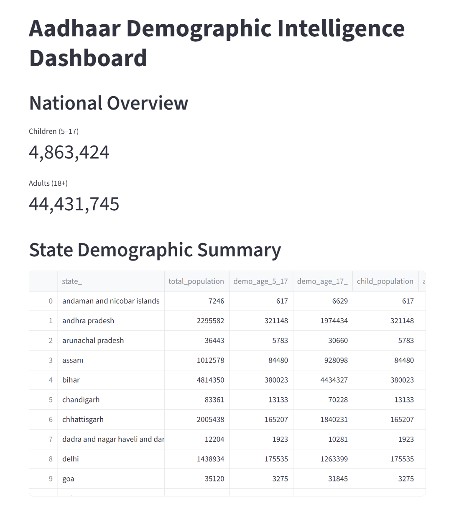
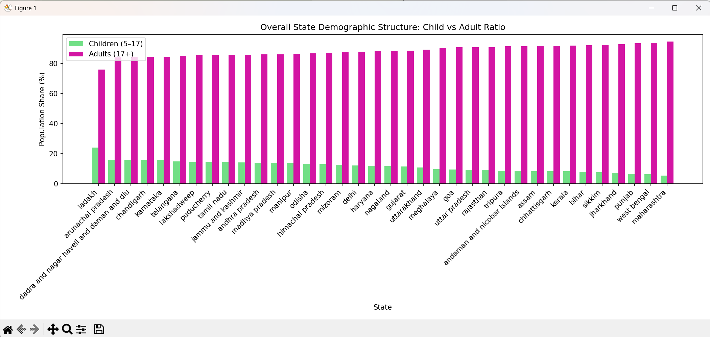
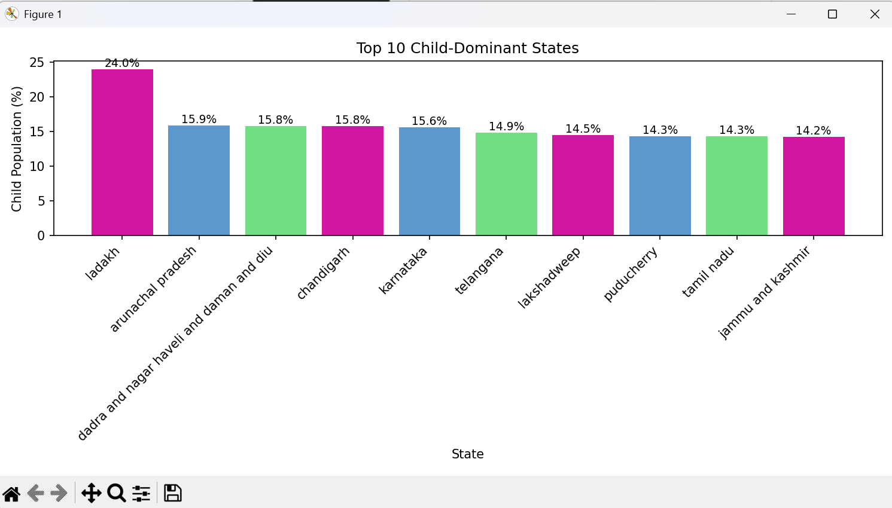
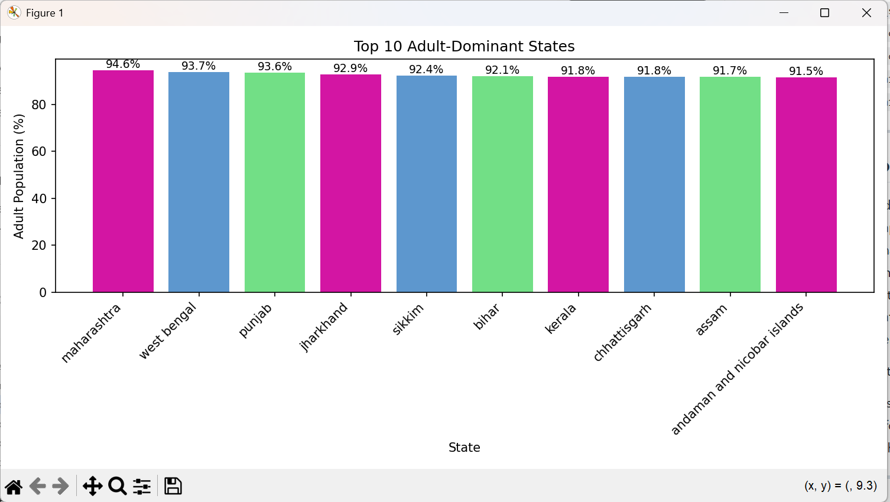

# Aadhaar Demographic Intelligence  
*UIDAI Data Hackathon 2026 Project*

## Visual Highlights






This project builds an end-to-end data intelligence pipeline on UIDAI Aadhaar demographic datasets to extract population structure insights across Indian states.

It transforms raw government data into:

- Cleaned and standardized datasets  
- State-wise demographic summaries  
- Child vs Adult population ratios  
- Top & Bottom ranked states  
- Analytical visualizations  
- An interactive dashboard  

The goal is to convert raw Aadhaar data into **policy-ready demographic intelligence**.

---

## Project Pipeline

The project is structured as a reproducible data pipeline:

| File | Purpose |
|------|---------|
| `clean.py` | Cleans and standardizes raw UIDAI CSV files |
| `merge.py` | Merges all cleaned CSVs into one dataset |
| `rank.py` | Computes demographic ratios and rankings |
| `visual.py` | Generates analytical graphs |
| `dashboard.py` | Interactive Streamlit dashboard |

Generated outputs:

- `state_demographic_summary.csv`  
- `state_child_top10.csv`  
- `state_adult_top10.csv`  
- `state_child_bottom10.csv`  
- `state_adult_bottom10.csv`  

Visual Outputs:

The project generates analytical visualizations saved under /graphs and displayed in the Streamlit dashboard:

- child_vs_adult_ratio.png — State-wise child vs adult population share
- national_child_population_share_over_time.png — Trend of child population percentage
- national_demographic_composition.png — National child vs adult composition
- top10_child_states.png — Top child-dominant states
- top10_adult_states.png — Top adult-dominant states

---

## Key Insights Produced

- National Child vs Adult demographic composition
- Complete state-wise demographic summary
- Top 10 Child-Dominant States
- Top 10 Adult-Dominant States
- State-level child vs adult population ratio comparison
- National child population share trend over time
- Interactive Streamlit demographic dashboard

These outputs help identify:

- Youth-heavy regions for education planning
- Adult-heavy regions for workforce and employment planning
- Demographic imbalance across Indian states
- Long-term child population trends at national level

---

## Data Source

This project uses publicly available UIDAI Aadhaar demographic datasets.

From:  
https://www.data.gov.in/

Files used:

- `api_data_aadhar_demographic_0_500000.csv`  
- `api_data_aadhar_demographic_500000_1000000.csv`  
- `api_data_aadhar_demographic_1000000_1500000.csv`  
- `api_data_aadhar_demographic_1500000_2000000.csv`  
- `api_data_aadhar_demographic_2000000_2071700.csv`  

---

## Run the Dashboard

To launch the Streamlit dashboard locally:

```bash
pip install -r pipeline/requirements.txt
streamlit run dashboard/dashboard.py
```

---

## Full Analytical Report

A detailed report of the analysis and findings is available here:

[View PDF Report](insights/UIDAI_Aadhaar_Demographic_Insights.pdf)
